# 小米路由器MESH个人评测

这可能是你们再网上能找到的关于小米路由器mesh的最详细评测。我自己认为已经基本上涵盖了所有你们需要了解的情况，如果还有什么方面没有涉及的，可以给我留言，我会补充。

这次买来的两套共四台小米路由器mesh，四台也就是小米路由器mesh能够支持的最大阵列。
小米官网和有品都卖999不打折，但显然市场并没有小米自己这么牛气，我是920块钱一套买来的。

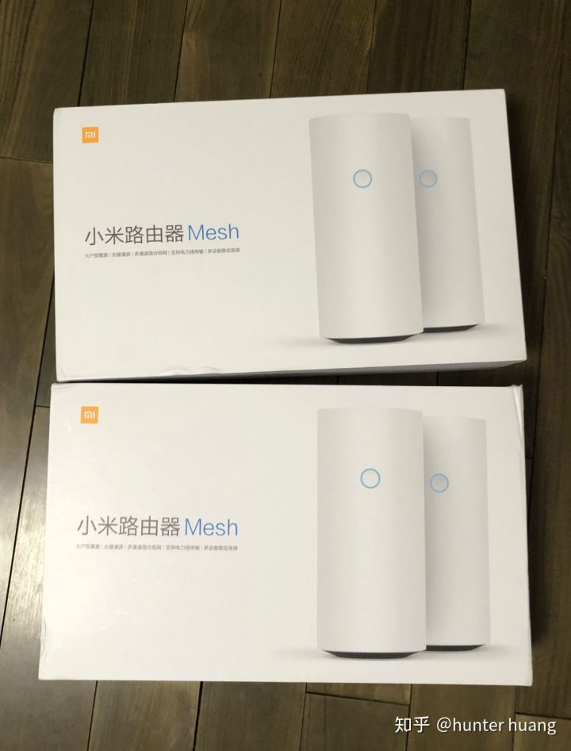

收到之后马上开始我的测试，到今天有三天时间，大致上有个初步结论。以后随着小米mesh的固件不断更新升级，我也会继续更新这篇测评。
正文开始

在mesh路由器发展起来之前，wifi覆盖只有三种模式，1是使劲加大天线的发送和接收能力，期望以一个路由器搞定整套房子的wifi覆盖；2是在信号覆盖不到的地方使用第二台AP或者信号扩展器来补充；3是使用AC+AP的方式实现覆盖。

我之前在wifi上面都是用这三个思路来解决问题。我自己家，楼下一层楼用一台强力的路由器，楼上一层楼用一台强力的AP；我给朋友解决家里wifi覆盖的问题，基本上就是电力猫（可以看做一种AP）；我给公司使用的wifi，用的是AC+AP的方案。

这就是公司的Ruckus方案，一台AC带6台AP，效果非常好，但是这是靠钱堆出来的，这一套花了好多万块钱。

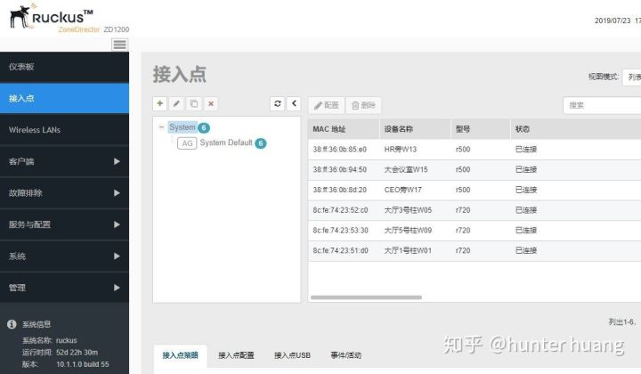

现在我们有了第四种方式，用mesh路由器来实现覆盖。

实际上作为一个专业的IT人员，我对mesh的定义至今仍然是糊涂的，我原本以为mesh是各节点之间的组网方式，指的是各个节点之间抛弃了中心化的混合组网，但问题是所有看到的mesh设备全部都是路由器加AP，我也刚看了爱否科技的关于小米路由器mesh的视频评测报告，他又号称802.11k、v、r三种方式支持其中一两种就是mesh，我反正是没有看过哪个技术文档提到这个说法的，而且问题是802.11kvr三种模式都是节点与终端的协议，节点与节点之间的不管吗？

我还有一个Netgear Orbi RBR50，这玩意也被叫做mesh，但是我从来没看到过Netgear说它跟802.11kvr有什么关系，有趣的是Orbi还要分主体和分身，硬件是不同的，这个设计就很不好，比如你无法买两对Orbi来实现1+3的效果，或者说如果你买了1+3，那么你将来无法把他们拆分成两套1+1来使用。

讲回小米路由器mesh，他最大的特点，就是各种技术他都有，单纯的从技术参数上看，表现非常均衡。
相比Orbi，它不需要分主体与分身，各种组合非常灵活。
相比华硕ASUS Lyra Trio，支持的节点更多。
相比华为Q2 pro，支持802.11 kr，华为的到底支持什么格式至今语焉不详。而且华为使用螃蟹芯片是绝对不能接受的。
相比Linksys Velop，他支持电力猫作为连接方式。
最重要的是，跟以上这些兄弟们比起来，单个节点500块无疑就是mesh产品里面性价比最高的了。

还有一点，这些mesh路由器里面，小米mesh是唯一一个内置电源的。真的我一直都想不通为什么以往的路由器都要用外置电源，路由器本身做大那么一丁点就可以把电源容纳进去，然而如果电源外置，在电源插板上就会非常拥挤，导致插板效率低下。比如说Orbi，你去看它的电源，它插到插板上，除非是插在最边缘，否则它一个就要占三个位。Velop也是一样的，它插到插板上，左右两边的两个插孔全作废！

我的房子比较大，有上下两层，所以wifi信号覆盖一直都是比较困扰我的问题。
先上我的房子的简单图片。

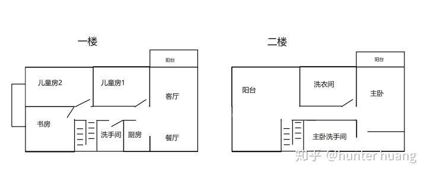

看一下一楼具体的信号覆盖情况

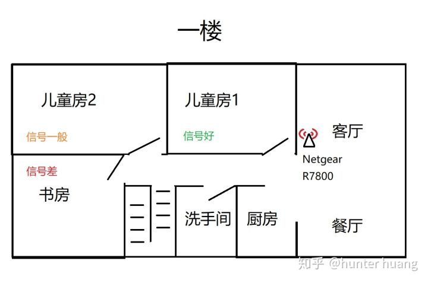

一楼所画有一个天线标志的地方，就是电视柜，也是弱电箱，电信的入户光纤就是到达那里，所以基本上路由器就是要安装在那里的。家里的所有房间都有网线到那里，有一台千兆核心交换机在那里，NAS也是在那里。

我目前就是在一楼电视柜那里放一台Netgear R7800路由器，它就兼任一楼的wifi覆盖。

这里我要赞一下R7800，他是我见过的消费级无线路由器里面信号最强的，没有之一，真的是网件的堆料之作，高通8065，1.7G双核CPU和512M RAM，使他无论干什么都绰绰有余从容不迫。强大的外置桨式天线，信号真的只能用牛X来形容。它是网件R7000的继任者，我也是从R7000升级过来的，也许我的粉丝们听说过R7000超强的信号覆盖能力，而R7800的信号比R7000更强，特别是在5G的覆盖能力上，强得多！

但是实际使用上，R7800覆盖我目前的一楼仍是力有未逮的，比如说在儿童房2的最左边和书房的最左边，信号都是很弱，儿童房2里面根本就找不到5G频段的信号，而书房最左边即使使用2.4G仍然时不时掉线。儿童房2是我六岁女儿的房间，老婆每晚要哄女儿睡觉，陪睡时要看手机，对于这里的wifi信号她非常敏感，一旦掉线河东狮吼。而书房又是我自己常用的地方，信号对我来说非常重要。

说完一楼我们说二楼。二楼的目前信号覆盖如下：

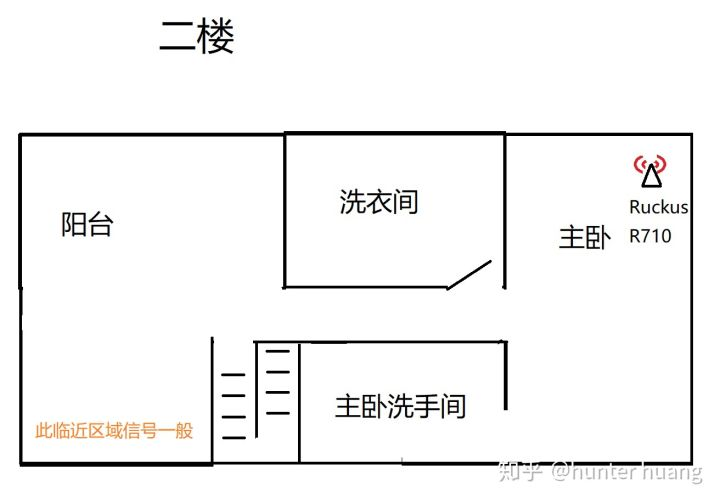

二楼也是依靠单台AP覆盖的，二楼用的是一台Ruckus R710的AP，单说这台AP可能很多朋友不熟悉，我只说价格你们就知道它的实力，它是花了三千五百块买来的。它的信号确实很强，连上之后速度飞快，各种表现都说明了它确实是一台顶尖的AP。但问题就在于，它信号太强了。为什么信号太强也是问题呢？它的位置在主卧，主卧处于客厅的正上方，它的信号穿透了楼板，覆盖了一楼的客厅。这就造成了一个问题，我回家的时候，从外面开门进入客厅，我的手机有一定几率会在这时候直接连上二楼的wifi，这样它有信号，但是信号弱速度慢。我在客厅时如果发现手机上网很慢，我就心里有数一定是连到二楼的wifi去了，进手机设置去把wifi重新连到一楼的路由器就好了。这也是一种麻烦。

可能有同学会问，为什么一楼和二楼的wifi名称要不一样呢？是不是一样的话就没这些问题了？不是的，如果wifi没有一个统一管理的话（也就是mesh系统或者AC），那么你就一定不要用同一个wifi名称，因为问题一样会出现的，不同的是如果wifi名称不一样，你还能够手动切换，如果两个基站wifi名称一样，你连手动切换都做不到了。

然而楼上楼下两个wifi名称最大的问题就是这两个名称本身。有些wifi设备是没有那么方便去切换wifi SSID名称的，比如各种智能家居产品，偏偏我家多得是这些东西。比如说空气加湿器，有时候楼下小朋友喉咙不舒服，想着加个湿，把楼上的加湿器拿下去，结果加湿器就要重新配置才能连楼下的wifi，这样非常麻烦。

那么最终我还是要回到全家统一一个wifi SSID的目标上来。

之前我一直在考虑的还有一个选择，就是AC加每房间一个入墙的面板式AP。但是这个方案也一直在犹豫没有执行，因为Ruckus我又嫌贵、TP-link我又嫌太低档，Mikrotik和UBNT我又没怎么搞过觉得学习成本太高，就一直这么拖下来了，要不是这次小米路由器mesh让我感觉上比较靠谱，也许这事还会一直这么拖下去。

总共买下来两套，也就是四台，这也是小米路由器mesh支持的最大组网节点数。接下来就是我用小米路由器mesh的实战了，分为两部分内容，一个是如何用小米路由器组网，二是小米路由器的实际效果和功能。

先讲一下小米路由器mesh的组网逻辑，他有一个特别的地方，就是在有他的组网里面，必须由他来担当路由器的角色。
好比说你有另一台更强的设备，想要当主路由，然后用小米mesh当几个AP，类似下面这个图，是不可以的。

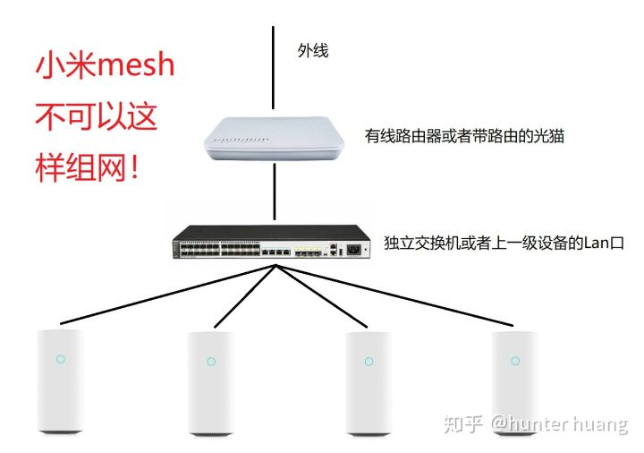

但有意思的是，网件的Orbi，虽然硬件上要分子母，但是他倒是支持这样组网哦，所以如果哪位粉丝非要组个这样的网，那就只能考虑Orbi。
小米路由器mesh的组网必须是这样的：

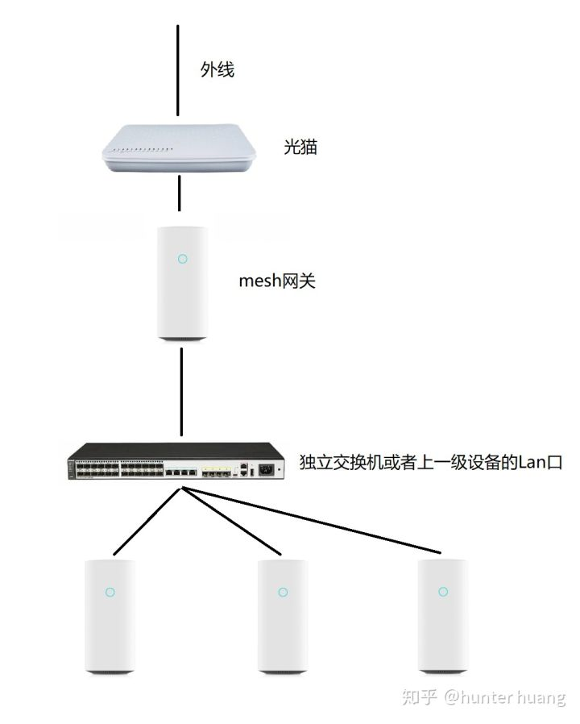

即使你已经有有线路由器，或者你的光猫本身有路由功能，都不行，必须由他再路由一次。
我计划中的组网拓扑图如下：

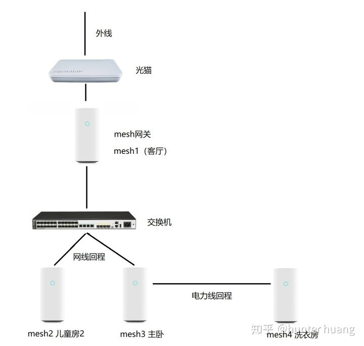

为什么最后有一台是要用电力猫连接倒数第二台呢？因为我计划中的摆放是这样的：

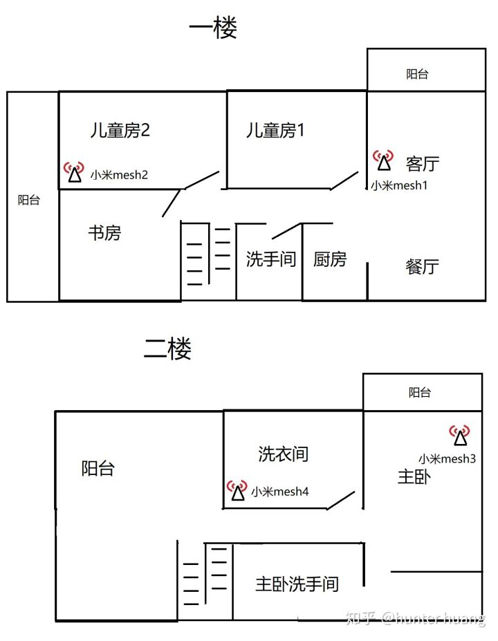

Mesh4之所以要用电力线回程，是因为洗衣间里装修时没有留网线。。。。。。
但是小米mesh并不是我想怎样就怎样的。
我配置好洗衣房的mesh4之后，他一直显示紫色灯。

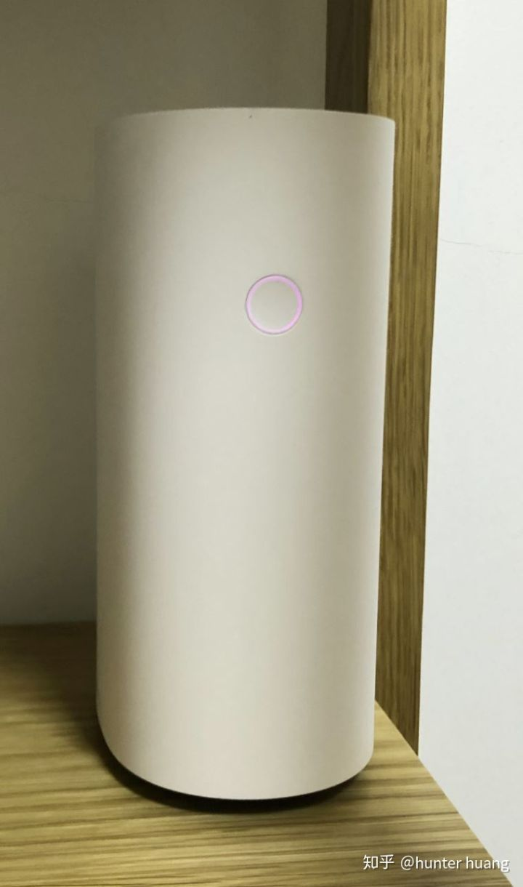

并在app上提示如下：

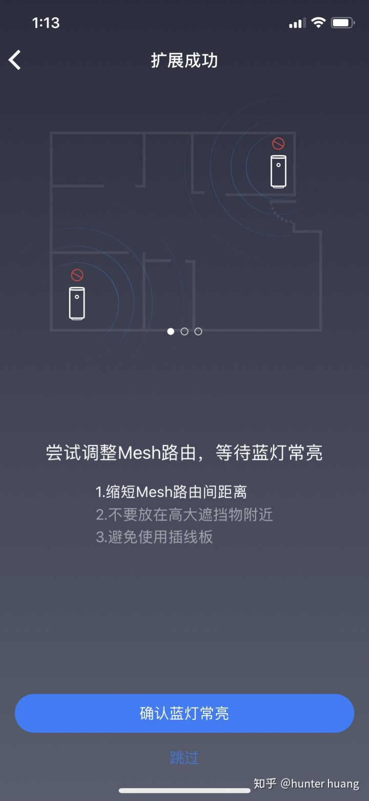

我经过无数次尝试，不断改变mesh4的位置，最后甚至把mesh4摆放到了mesh3的旁边，都没有任何作用！mesh4显示的永远都是紫色灯，表示自己回程信号很差。

我进入小米wifi app看到mesh4的状态是这样的：

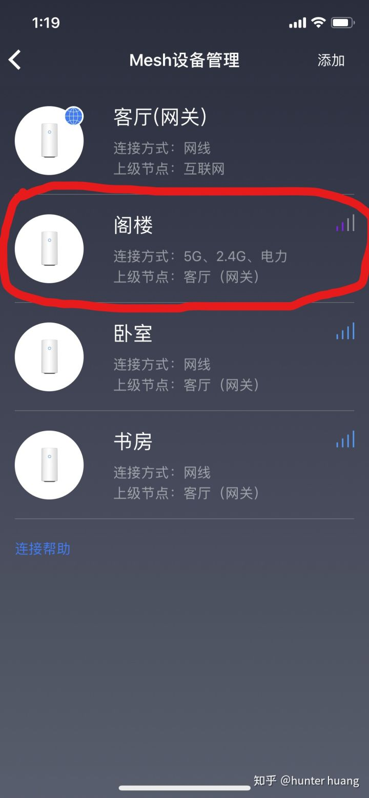

我圈出来的那个“阁楼”就是洗衣房的mesh4，小米这个app不允许用户自定义节点名称，因为选择里面没有洗衣房，才选了阁楼，下面的书房实际上是儿童房的mesh2，卧室就是主卧的mesh3。

我们看到mesh2和mesh3有用网线连接到客厅的主交换机，所以都使用了网线回程到客厅的mesh1，这是对的。但是洗衣房也就是写作阁楼那个mesh4，他没有网线，上级节点也一样是客厅的网关mesh1，这就很有毛病了！

实际上在洗衣房所在的位置，mesh1根本就没有无线信号到达，所以它回程到客厅mesh1的实际唯一方式就是电力线，而在洗衣房用电力线回程到客厅的mesh1是非常愚蠢的，因为电力猫不能经过空气开关，而他。。。。。算了，看图：

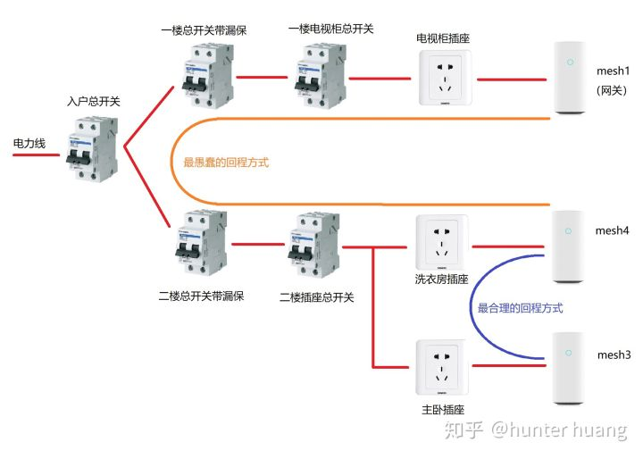

也就是说mesh4不使用我认为的最好的回程方式，也就是电力线回程到mesh3，这种回程理论上最稳定，而且不经过任何空气开关。它也不使用次一级的回程方式，就是5G回程到mesh3，甚至也不使用2.4G回程到mesh3——总之他就是对着信号极好的mesh3永远视而不见，一定要回程到信号极弱的mesh1！哪怕要经过四个空气开关也在所不惜！

为什么mesh4会这么嫌弃mesh3呢？为什么？？我像古时代的老鸨子一样非要把他们撮合在一起，我把mesh4安放在了mesh3的旁边，让他能清清楚楚看到mesh3的漂亮的侧颜，而且它们的电源线插在了同一个插线板上。

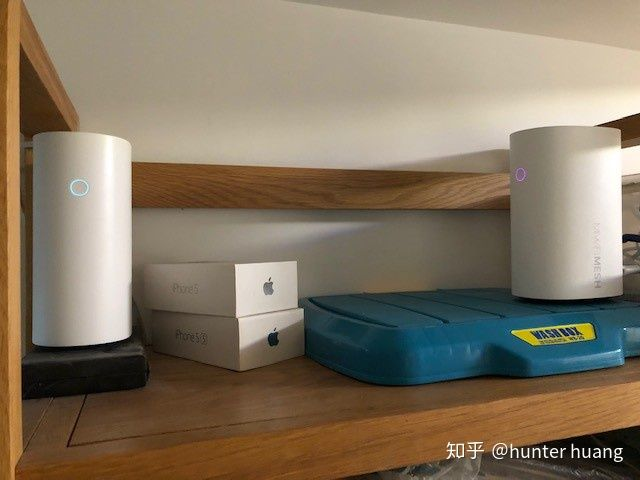

没用！mesh4始终亮着那个紫色小灯在显示他对mesh1正宫娘娘的忠贞不屈。
后来我实在忍不住了，把mesh4的那条网线拉出来，对着mesh3后面的洞就这么一插！
这回搞定了，mesh4显示网线回程到mesh3。
但是只要我把网线一拔，真的是拔X无情啊，mesh4的心又飞回mesh1那里了。
所以经过这一番折腾，我已经清清楚楚小米路由器mesh的组网逻辑了，它的逻辑是这样的：
如果有网线，一定走网线回程到另一端节点。
如果没网线，走任何方式回程到网关节点。

如果……还有如果吗？没有了！因为只要这东西在一个房子里，它们总是插在同一个入户电源上的吧，你能够跨越四个空气开关去找网关这么百折不挠，我还有什么办法让你不去连网关？除非我把网关插在发电机上！

到我写完这篇东西之时，这个问题仍然没有解决，这个问题非常严重，说明了小米所谓的智能组网根本就是骗人的，甚至可以说它跟mesh技术规范里面的自由连接根本也是冲突的，这套设备到底还能不能叫做mesh，都值得商榷。

我现在二楼仍是按照我计划的那样摆放，现在有个很搞笑的地方，就是洗衣房，我呆在洗衣房里的时候，手机或者平板连上wifi以后，到底是200M还是10M的网速，是要看运气的，如果他连的是mesh3，那就是200M；如果他连的是mesh4，就低于10M。而mesh3和mesh4的wifi名称是一样的，我在终端上无法选择连接哪一个，全凭运气。

其实小米要解决这个问题相当容易，他只要在设置页开放连接节点和连接方式的优先级选择，如果开放的是节点选择，那么我让mesh4优先回程mesh3就搞定；如果开放的是连接方式优先级选择，那么我让mesh4优先选择5G回程，也一样解决问题。但是这么简单的事情，小米没有做。我不知道还能忍耐多久，感觉如果小米下一个固件不能解决这个问题，也许这套东西就会进垃圾桶。

第一部分小米路由器mesh如何组网就先到这里。接下来是第二部分，看看小米mesh的信号质量、网速以及功能。
小米mesh的使用效果。

首先说它的信号质量。我做了一个测试，这个测试里只使用单台的小米mesh，与Netgear R7800摆放在同一个位置上，然后在其他几个位置用手机分别测试连接到小米mesh和R7800 5G及R7800 2.4G的上网速度。

测试时组网方式是用Netgear当主路由器来拨号上网，小米mesh再接到Netgear的Lan口，他会自动判断自己接到了一个不需要拨号的外网。

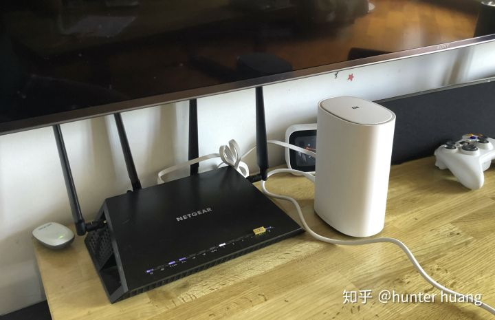

我的测试逻辑是这样的，对于R7800，如果5G测试的结果接近满速，就不需要再测试2.4G的速度，如果5G的测试结果不满速，就再测试2.4G的速度。而小米mesh是无法由用户选择5G还是2.4G的，所以就只能直接测试。

测试结果如下：

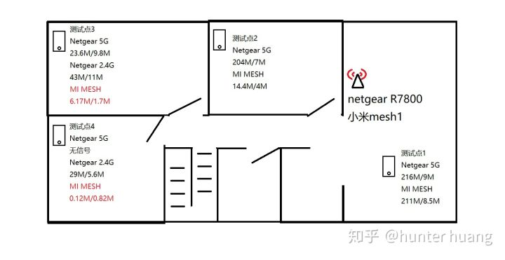

测试点1位于客厅，其实就是测试面对面时候的速度，可以看出在最好情况下，大家都是达到宽带的最高速度，小米mesh与Netgear R7800并无明显区别。

测试点2位于儿子房间，这个房间与客厅的隔墙是很厚且有密布钢筋的承重墙。在这个测试点，R7800一骑绝尘，以强大的信号能力迅速将小米mesh斩于马下。在这里，R7800的5G仍有极快速度，而2.4G也是接近满速，而小米mesh简直就在说“救命啊我不能穿承重墙！”

测试点3位于女儿房间，在这个房间里，R7800的5G已经信号素质很差了，这种情况下甚至还不如它的2.4G有用，而小米mesh也有2.4G信号，但是速度不到R7800的一半。

测试点4在书房，这里R7800已经彻底没有5G信号了，2.4G信号摇摇欲坠，但是好歹2.4G还是能通讯的，小米mesh则完全不可用。

我在测试时，不出意外的发现一点小米的老毛病，这么多年一直改不掉。我们可以注意到，当设备连到网件的时候，你看到wifi信号强，网速就快，看到wifi图标掉格了，网速就变慢了，网速快慢是和wifi的格数挂钩的，很直观。而用小米的时候就不是这样，大部分情况下，我们看到小米的信号都是满的，但是网速有快有慢，似乎网速和小米的信号强度没有多大关系，而如果你看到小米的信号掉了一格的话，大概率是连网都上不了了。

为什么会出现这种情况呢？因为小米在wifi发射信号上加强功率，以造成它的信号更好的假象，实际上是作弊。我之前在上课的时候讲过，任何一个IP设备，它的发送和接收都是同时发生的，好比说你在下载文件，并非说你只有下载而没有上传，所以你的设备就只接收不发送，不是的，你下载一个文件时，这个文件在彼端被拆分成很多个数据包逐个发给你的设备，你的wifi路由器每次发给你一个数据包，会问“收到了吗”，你的手机会回答他“收到了”，他才发送下一个；相反的如果你的手机不回复，他就一直不发下一个，那就等于连接中断了。所以呢，对于任何一个设备来说，他接收的同时也在发送，发送的同时也在接收，发送的能力要和接收的能力相匹配才有意义，纯粹发送强而接收弱是没有用的！

一个路由器要强化自己的发送能力根本就易如反掌，只需要加大发射功率就可以了，不需要成本，而要强化自己的接收能力就难了，那需要更大的天线，更强的降噪算法，不是可以轻易做到的，要下很大的本钱才行。

小米在明知道自己接收能力不行，还一味的加大发射功率来强化发送能力，说白了就是为了造成信号强的假象，是一种造假行为。（好在我不是干评测的，要不然因为这句话就要被开除了）

小米的这种玩法还会造成一种情况，就是手机错判密码错误。有人说我的小米路由器，信号是满的，我连wifi，明明密码是对的，但是手机每次都提示密码错误，为什么会这样？那就是因为小米的路由器发射功率太强，手机判断信号满不满是纯粹看对方的信号强度的，但是，他要连这个小米的wifi的时候，他发送了密钥过去，实际上小米路由器接收不到他这段数据，于是手机认为路由器没理他，手机就想，他不理我，是不是因为我发送的密钥是错误的，那，还是麻烦你再输入一次密码吧。

所以呢，我们测wifi，千万不能看信号满不满格，也不要装了个app比如wifi分析仪就拿来看信号强度，这些都没用，一定要测试实际上下行速度。
接下来我们看小米mesh如果在一楼部署两台，信号表现是怎样的。

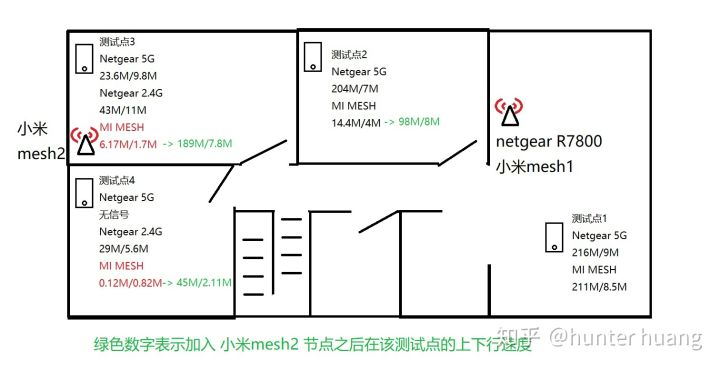

这次只测试原本小米mesh信号弱的三个测试点，把新的结果用绿色标示在上一个测试结果上，你可以很容易的看出来多了mesh2之后的表现。
在这个测试里我们看到，只要有mesh2节点存在，表现就很明显超过原本的单台mesh1，也明显超过了单台R7800。

我在客厅和书房之间反复移动，手持一台手机始终开着直播以及另一台手机开着游戏，尝试两个设备在mesh1和mesh2两个节点之间切换是否会造成可见的延迟、丢包卡顿等情况。

测试结果，以上情况没有发生，说明了小米mesh在无缝漫游方面确实做得不错，比我以前试过的Netgear Orbi要好，也比华硕Aimesh要好。
但是我们要留意一点，据说mesh路由器的终端无缝漫游，是依靠三个协议来实现的，这三个协议，支持的越多，无缝漫游就越好。
这三个协议是：802.11k 、802.11r 、802.11v
在终端设备上，苹果在iphone5S之后的所有机型包括ipad都同时支持这三个协议。
而对于小米路由器mesh来说，小米官网显示该设备支持802.11k和v。
但是其他手机呢，包括小米手机，我在小米官网上查看小米最新的小米9的参数，发现根本就没有提到802.11kvr三个协议，是否支持情况不明。
而华为手机则网上搜到的消息是全部型号均不支持。
所以如果你用的不是苹果设备的话，有可能在小米mesh上是不能得到这么好的漫游体验的，非苹果设备的测试等我有空的时候再做一次。
最后讲讲功能方面
小米mesh没有USB口，因此做什么文件共享服务、打印共享服务都别提了。
也没有NFC，以前曾经有过的NFC触碰上网功能也没有了。

网口只有三个，这个就真的少了一点，我的意思是少了一个，你想想如果有人想要用这套mesh路由器来组网，房子也是刚装修房间都有网线，那么问题来了，网关上面只有三个网口，一个当wan口，剩下两个只够插两个节点，你是说让第三个扩展节点走无线回程呢？还是为了缺个网口再买个交换机？

VPN只支持PPTP和L2TP，不支持IPsec，总之专业人员需要的很多功能都欠缺，不过这个对于家庭用户来说不是事。

2.4G频段和5G频段是合并的，不能分为两个SSID。这个有点不讨人喜欢，毕竟少了个选择总不是好事。不过Orbi也是这样，可能主流就是如此，我也已经习惯了。它也不能单独关闭2.4G只使用5G。

然后关于MU-MIMO和Beamforming波束成形，这个是小米宣传上的一大卖点，只不过这个功能在app里面是没有开关的，然后到web设置页才能找到他，你猜咋地，默认是关闭的！

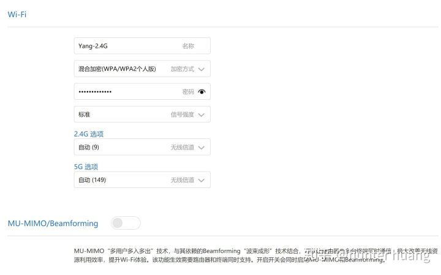

最麻烦的，它不支持客人网络，这个太讨厌了。客人网络的意义有两点，第一是避免家庭wifi的主要密码外泄，因为主wifi密码是要给家里各种智能家居设备联网的，一旦修改主密码，就要将每一个智能设备重新联网，那工程就太大了！而如果经常将主密码告诉客人的话，说不定没多久那些wifi共享软件都知道你家的wifi密码了。所以我们启用客人wifi，三不五时改一下客人的密码，就没有密码外泄的风险；第二是我们只想给客人上网，并不想他们能访问到家里的NAS、摄像头等设备，具备客人网络的路由器会创建一个独立的子网，子网里的客人只允许访问路由器而禁止访问局域网里的其他设备。

小米wifi app打开后首页显示所有的在线设备，而且自动为它能认出来的设备加上不同的图标，比如米家的各种灯泡、台灯、扫地机器人，让你清晰明了这是个什么设备，这个功能很有意思，另外它没认出来的设备也允许你自己编辑名称并选择图标，我装好这套路由器的第一个晚上就花了几个小时慢慢的把那些在线设备一个个找出来并标注清楚，忙的不亦乐乎。但是你在app里面给各个联网终端手工填写的设备名称是不会同步到网页的设备列表里的。

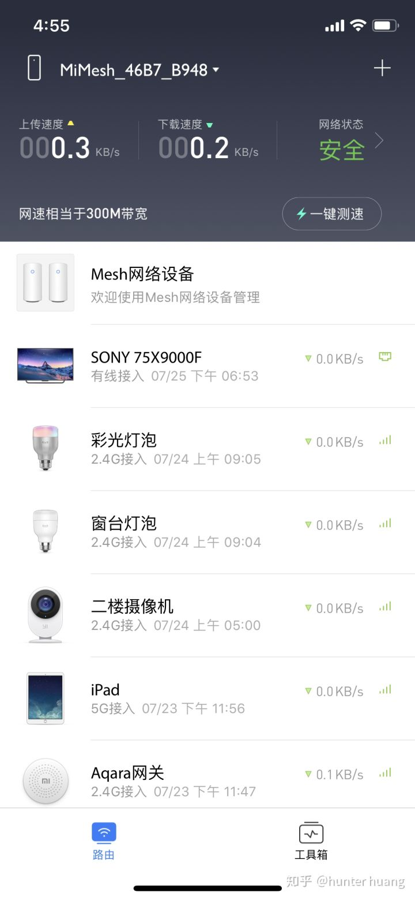

有些设备内置的图标不全，比如Aqara网关，所以只能用米家网关的图标了。

App和web设置页面各有各的特点，有些事情网页能做而app不能，比如局域网IP设置，有些事情app能做而web不能，比如查看mesh节点的回程状态。这种玩法无疑加大了顾客的学习成本。

我第一天安装完成后，要做的第一件事就是修改dhcp范围，因为我必须让dhcp分配范围避开我的NAS和摄像头等固定IP的设备，但是我在app里面死活找不到这个项目，于是我转而尝试从网页设置，但是打开浏览器开web地址以后，它问我要管理密码。。。我记得我从来没有设置过管理密码，路由器本身的初始配置是用app完成的，app第一次打开要求我绑定小米ID，然后要我设了一个wifi密码，就没有了，我根本不知道web的管理密码是什么，后来不断寻找，终于找到了，网页设置的密码必须在app里面的“工具箱”-“路由设置”-“硬件与系统”-“重置管理密码”里面才能设置，我快被逼疯了才找到这里。

最后我发现其实mesh节点名称是可以修改的，但是在app里面不行，app里面就只能在默认的几个里面选择，但是打开浏览器，进入[http://](https://link.zhihu.com/?target=http%3A//miwifi.com)miwifi.com这个网址，会打开mesh的网络拓扑图，点击想要修改的那个mesh节点，输入密码登录以后，点击右上角的节点名称，这时候就可以给你修改成自定义的节点名称了。打开节点的web设置页面，你不能看回程状态，不能选择回程状态，不能看联网终端，不能看网速，基本上唯一能做的时候就是修改这个节点名称。

在app里面，还可以针对任意一个联网设备，指定访问控制，就是只允许它访问白名单的网址，或者禁止它访问黑名单的网址。问题是白名单和黑名单是每个设备都要单独去添加网址的，而不能说先制定一个或若干个黑名单之后，在每个设备设置那里打钩生效。还可以设定设备的联网时间，就是几点到几点可以上网，其他时候不可以，这个功能可以防止小孩半夜偷偷上网。

最后把历代退下来的路由器们合个影吧。原本还有几台华硕，只是华硕非常抢手，退下来三台都很快就被人抢走了。

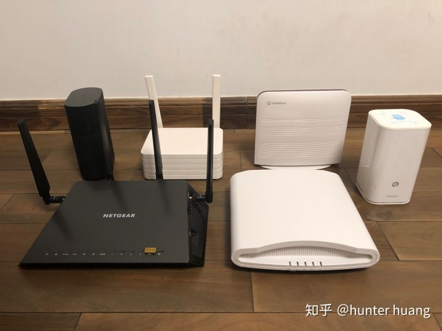

最右边那台有人认识的吗？

我是一个很贪玩的人，家里好玩的东西很多，尤其是针对家电及智能化方面。有同好的朋友可以移步这边一起讨论。

编辑于 2019-07-26

_yay_

[back](../)

