# 小米Note 10 評測：難怪可以殺下華為Mate 30

小米前日在北京發佈了全球首部採用 1億像素的手機 小米CC9 Pro，而在昨日，小米在西班牙發佈了 小米Note 10。咦？兩者之間有什麼直接關係？聰明的讀者應該已經猜到，小米CC9 Pro 的國際版本就 小米Note 10，而且根據非官方消息 小米Note 10 將會在11月底或12月初就會在港台地方上市。今日 Sky 就為大家身先測試小米Note 10，讓大家預先知道 1億像素的小米Note 10 有如何的實力在 DxOMark 上與華為 Mate 30 Pro 平分最強拍攝手機冠軍寶座？！

6.47吋 3D 曲面 AMOLED 屏幕，19.5：9比例，400000：1 對比度。雙曲面屏幕的生產成本終於下降了。

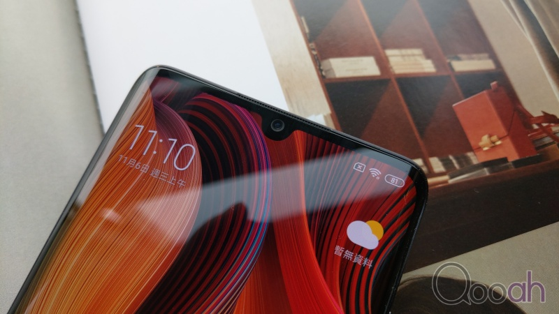

前置 3200萬像素鏡頭，f/2.0 光圈，1.6μm 4合1 超大像素尺寸。

下巴方面由於技術成熟，所以亦進一步縮短。
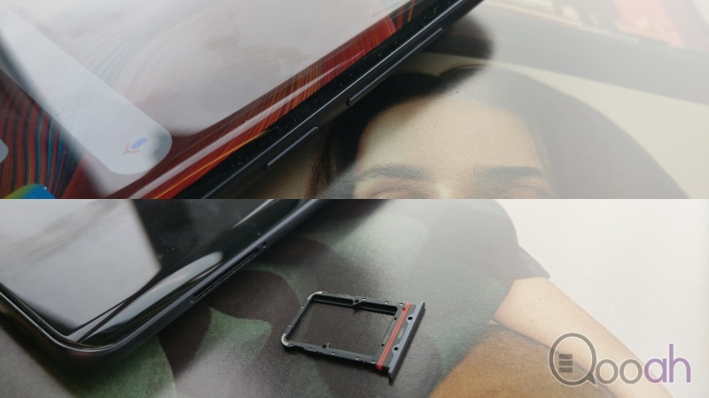

機身右側比較「繁忙」，Power 鍵 及卡槽都集中在這邊。

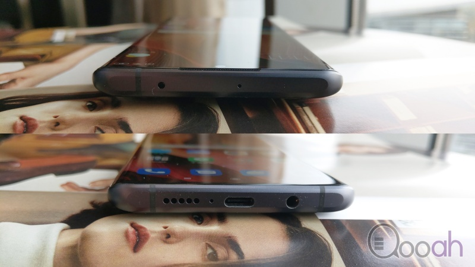

機頂有紅外線的遙控發射元件，而機底就有 3.5mm 耳機插口、USB Type-C 插口及 喇叭，這個喇叭還是 1cc 特大音腔的。

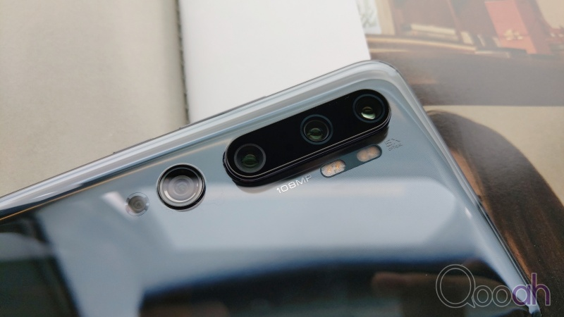

機背上有 5個鏡頭，分別是1.08億像素主鏡頭+2000萬像素超廣角鏡頭+1200萬像素 2X 長焦鏡+500萬像素 5X 長焦鏡+200萬像素微距鏡頭。詳細的鏡頭表現就留意下面的拍攝測試。

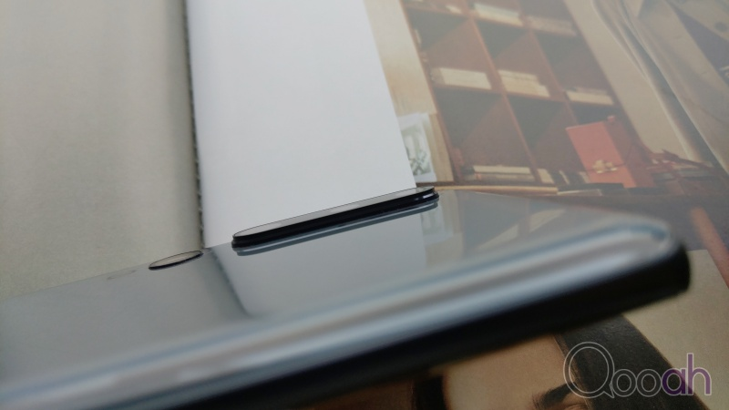

由於小米Note 10 的主鏡頭 1/1.33吋 超大感光元件，所以亦令鏡頭部件更加凸出，如果不用保護套應該會很易刮花。

機背同樣是非常流暢的 3D 曲面玻璃，反光效果非常耀眼。

小米Note 10 採用的就是 Snapdragon 730G 處理器，市場使用同款處理器的手機其實並不多，最近推出的 OPPO Reno 2 就是同款。G系處理器最大的特點就是大大加強了圖像處理器的性能，Adreno 618 GPU 700MHz。我們看看安兔兔的號分結果，25.7萬分。跑分結果略差 OPPO Reno 2 一點點。

電池是今次小米Note 10 的重中之重，首先是電池升級至 5260mAh，電池加量。根據 Geekbench 4 的電池測試結果，其電池表現令人震驚，達到9900分以上。在一般使用的情況下，輕鬆用兩天都沒有問題，玩遊戲時長更可以達到6小時以上，可以說是非常可觀。

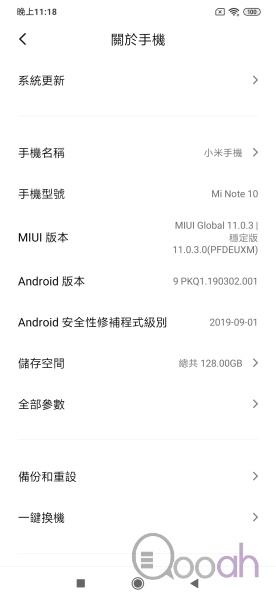

說說系統方面，小米Note 10 是全球首部預載 MIUI 11 國際版的手機，以 Android 9 為基底。

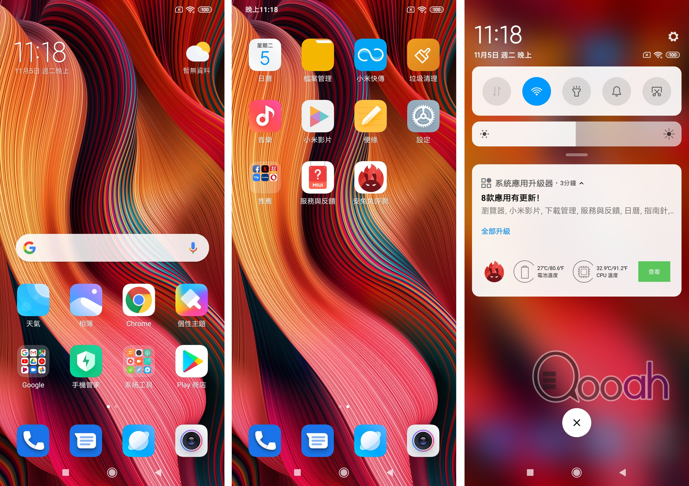

而 UI 方面，圖示以及使用排列都有更改。

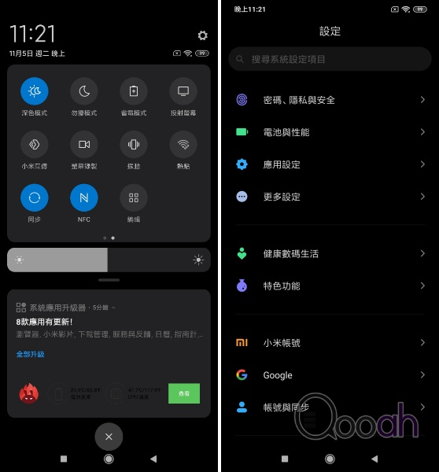

新系統已經有黑色 Dark mode，更省電更護眼。

鏡頭可以說是小米Note 10 的最強一環，能與一度是 DxOMark 王座的華為 Mate 30 Pro 媲美，他的實力應該不差，哪究竟有多強大？我們先看看鏡頭方面的技術參數。

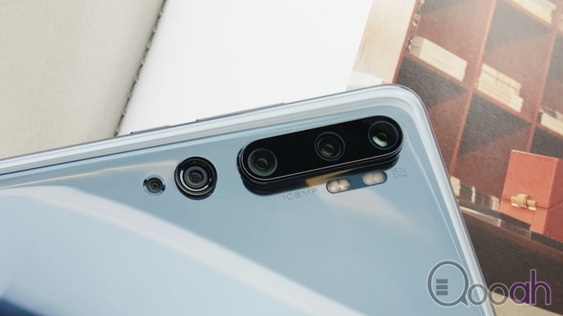

主鏡頭為 108MP，即1.08億像素，為現時手機最高像素紀錄。1/1.33吋超大底鏡頭，1.6μm 4合1 超大像素尺寸，f/1.69光圈，支援 OIS 光學防手震。然後是 1200萬像素的 2X 長焦鏡，f/2.0光圈。再來一個 500萬像素 5X 光學變焦鏡頭，支援 10X 混合變焦，50X數碼變焦，最重要是這個鏡頭還支援 OIS 光學防手震。還有一個是 2000萬像素 117° 超廣角鏡頭(f/2.2光圈)，最後最後就是一個 200萬像素的微距鏡頭(1.5 cm)。這個鏡頭組合如同專業攝影名詞「天涯鏡」，即是一部小米Note 10 已經可以走天潤。下面我們來看看這絕強的拍攝體驗。

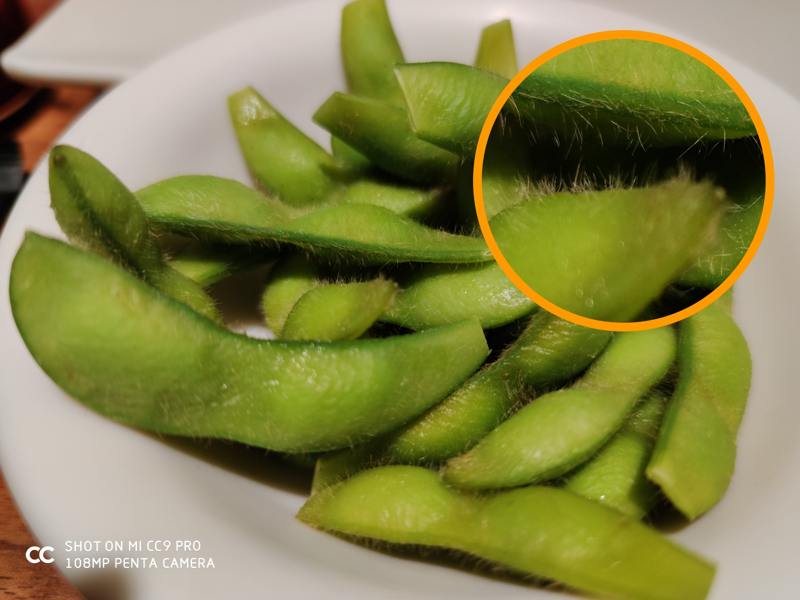

1億像素究竟如何？大家看看這照片，在 1億像素可以拍攝出毛豆身上細細看毛，不需要微距，亦不需要其他附助，簡單直接拍攝就可以。

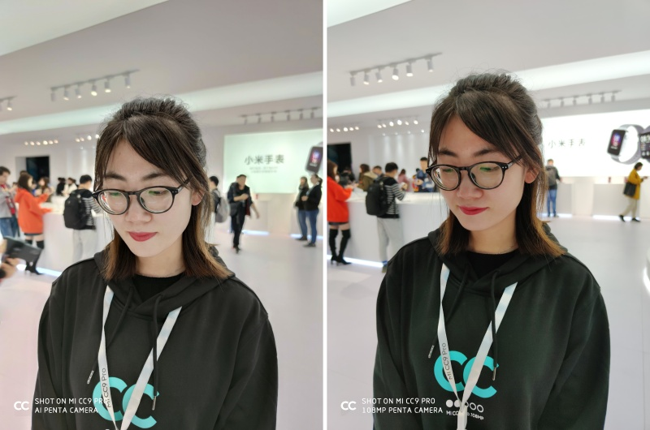

在測試中，筆者發現 1億像素這個主力鏡頭有一個奇怪的表現，首先如果不啟動 108MP拍攝模式時，拍攝出來的照片為 2700萬像素，這個我們理解的。我們一般情況下會認為在同一鏡頭拍攝，出來即使照片尺寸不同，細節的多寡之外，原來整張照片的質素都有明顯分別，這張在同一環境下拍攝的照片可以直接見到，右邊同 108MP 拍攝的照片由感光度、飽和度、色溫上都比普通拍攝下的主鏡頭強上太多。筆者分析認為即使在同一鏡頭下(硬件)，拍攝時的軟件演算可以是完全不一樣，如果拍攝時不考慮照片容量的情況下，大家可以直接考慮用 108MP 拍攝，效果會好太多。

說了這是「天涯鏡」手機，就是可以應對大部份的拍攝環境，究竟如何在手機上拍攝出超越你平時所拍攝的照片？

超廣角，拍攝全景畫面，氣勢磅礡。

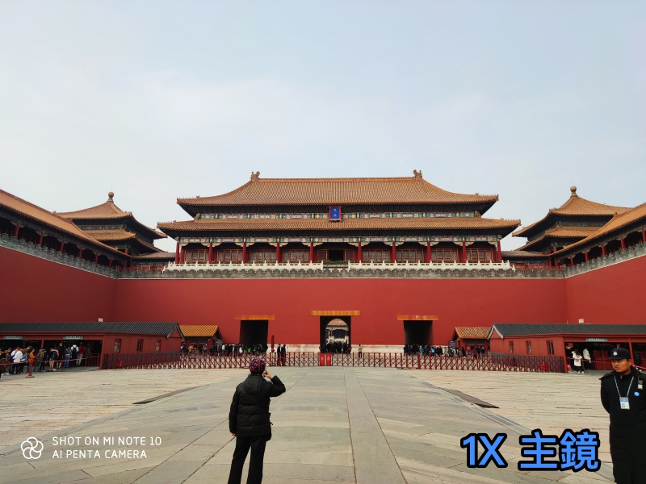

1X 主鏡頭拍攝，重點收入相內。

2X 拉近主體，收入更多細節。

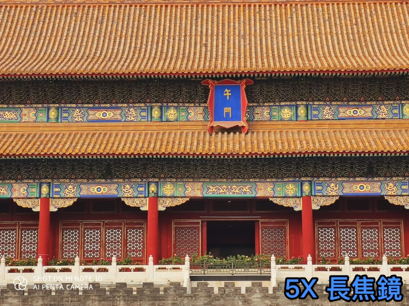

5X 基本已經可以把遠處影像收相內，大部分拍攝情況下都已經足夠面對，而且小米更細心地在 5X 這個鏡頭加入了 OIS 防手震，拎拍攝遠景時有更好的穩定性。

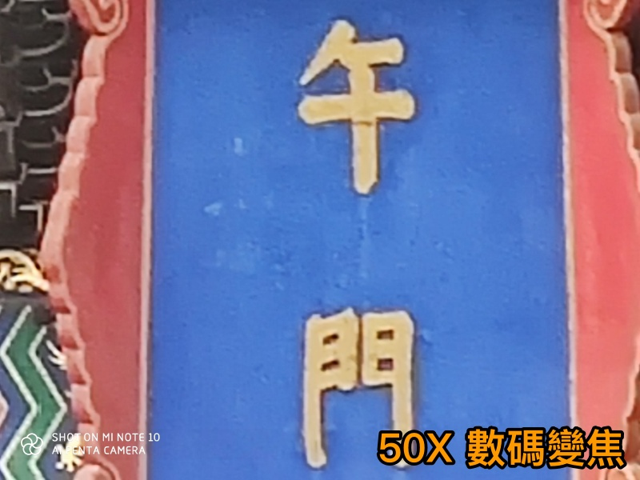

如果你還嫌不夠，小米Note 10 還提供了 50X 數碼變焦這極端的取景。
大家可以見到一部小米Note 10 幾乎可以應對大部份的拍攝情況。有人說，那變焦，如果走近一點拍攝不就可以了嗎？不對的，有些東西，走近了就拍不到。

這是1X 拍攝的照片，已經不取景不錯了吧？不過如果你對攝影構圖有要求，這樣是不夠的。我們試試同一位置換一個焦距？

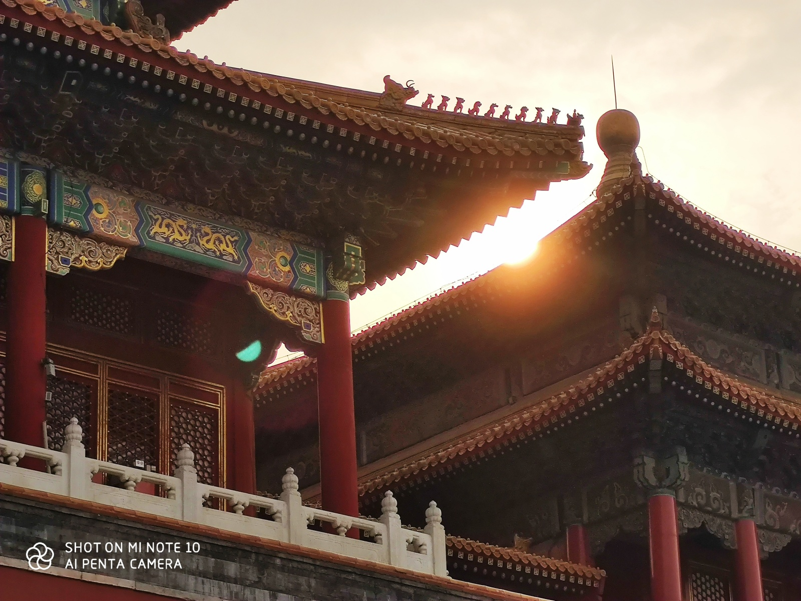

但是如果你有 5X 的變焦，你在同一位置就可以拍出這樣的照片，整個構圖就更好。
再來一個例子。

大家在這張照片上看到了什麼？是否沒有為意一個不起眼的東西？

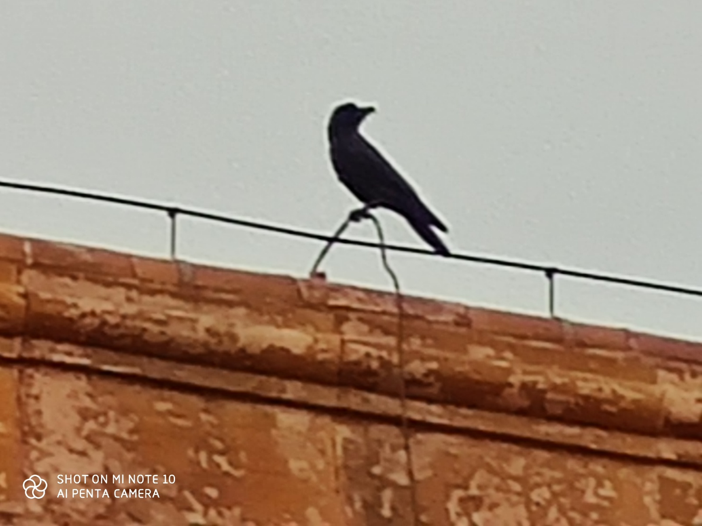

其實在城樓頂上有一隻鳥，如果沒有 50X 數碼變焦，你是拍不到它的存在。

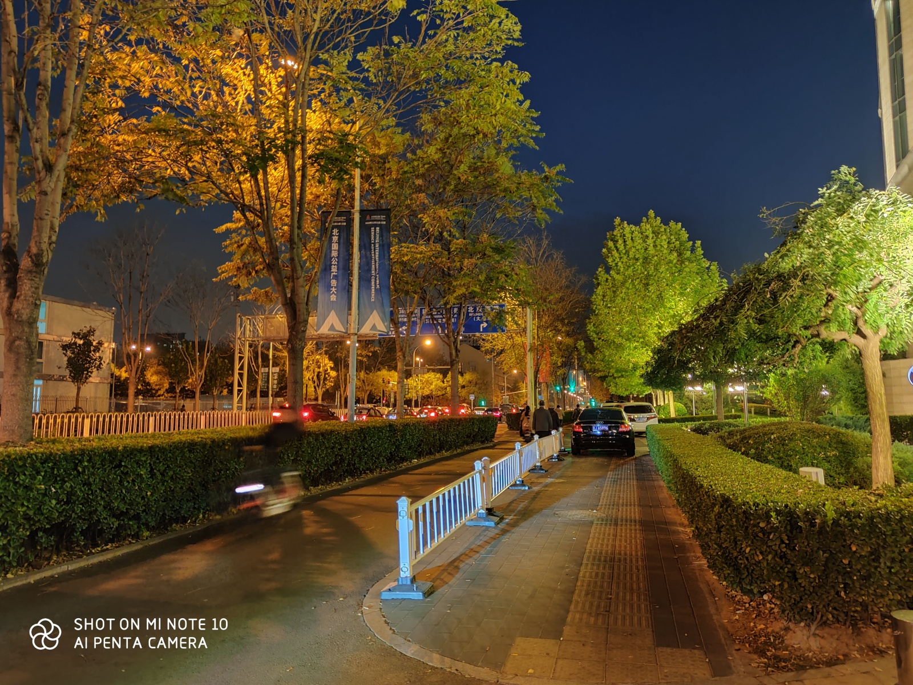

在小米9 的夜拍能力已經大大增強，而來到了小米Note 10，配合1/1.33吋特大的 CMOS，夜拍吸光量大大提高，令夜拍的能力再次突飛猛進，而且筆者個人感覺這夜拍能力已經完全超越了華為的 Mate 30 Pro。

拍攝食物方面在 AI 演算輔助下亦強大得多。

即使在低光下亦可以無明顯雜訊，色彩表現理想，而且銳利十足。

_yay_

[back](../)
